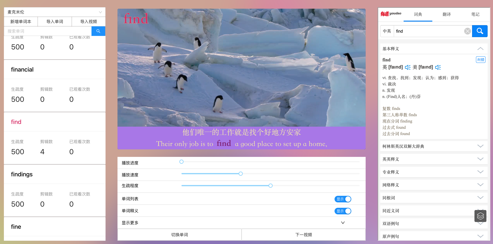

Comma 是一款帮助您利用视频资源学习单词的桌面应用。

它能够根据单词和字幕自动剪辑视频，将包含相同单词的视频片段归类整理，从而达到利用大量视频片段学习每一个单词的目的。

## 功能简介

### 导入单词

新建一个单词本，然后选择一个包含单词的 .txt 文件进行导入。

### 导入视频

将视频文件（目前仅支持 .mp4 和 .mkv 格式）与字幕文件（目前仅支持.ass 格式）放置在同一目录下，然后选择这个目录进行导入。

### 设置单词生疏度

单词的播放顺序是自动计算的。您可以根据熟练程度给每个单词设定生疏度，越生疏的单词出现的次数也越多。
